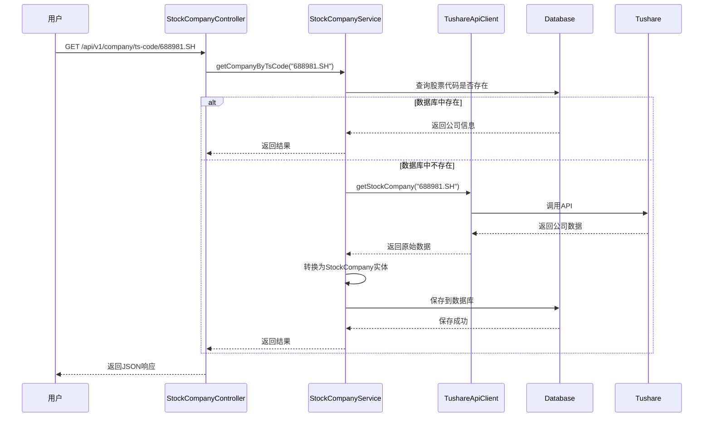
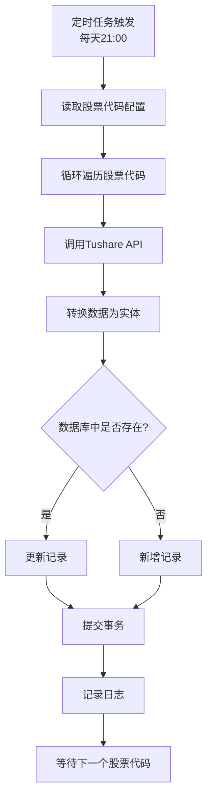

# 股票公司信息模块使用文档

> 模块功能：从Tushare API获取股票公司信息并存储到数据库
> 更新时间：2026-02-01
> 自动刷新时间：每天晚上 21:00

---

## 📋 功能概述

本模块实现了从Tushare API获取股票公司信息的功能，包括：

- ✅ **自动定时刷新**：每天晚上9点自动更新所有配置股票的公司信息
- ✅ **手动刷新接口**：支持手动触发数据更新
- ✅ **多种查询方式**：支持按股票代码、公司名称、城市、交易所等查询
- ✅ **数据持久化**：使用MySQL数据库存储公司信息
- ✅ **微服务架构**：遵循微服务设计原则，分层清晰

---

## 🗄️ 数据库设计

### 表名：`stock_company`

| 字段名 | 类型 | 说明 | 示例 |
|--------|------|------|------|
| id | BIGINT | 主键ID | 自增 |
| ts_code | VARCHAR(20) | 股票代码 | 688981.SH |
| com_name | VARCHAR(100) | 公司名称 | 中芯国际集成电路制造有限公司 |
| chairman | VARCHAR(50) | 董事长 | 刘训峰 |
| manager | VARCHAR(50) | 总经理 | - |
| secretary | VARCHAR(50) | 董秘 | 郭光莉 |
| reg_capital | DECIMAL(18,4) | 注册资本（万元） | 800028.4472 |
| setup_date | DATE | 成立日期 | 2004-02-26 |
| province | VARCHAR(50) | 省份 | - |
| city | VARCHAR(50) | 城市 | Grand Cayman |
| office | VARCHAR(500) | 办公地址 | 上海市浦东新区张江路18号 |
| introduction | TEXT | 公司简介 | 世界领先的集成电路晶圆代工企业... |
| website | VARCHAR(200) | 公司网站 | www.smics.com |
| email | VARCHAR(100) | 邮箱 | ir@smics.com |
| business_scope | TEXT | 经营范围 | 从事集成电路晶圆代工业务... |
| employees | INT | 员工人数 | 19186 |
| main_business | TEXT | 主营业务 | 主要为客户提供0.35微米至14纳米... |
| exchange | VARCHAR(10) | 交易所 | SSE |
| create_time | DATETIME | 创建时间 | 自动生成 |
| update_time | DATETIME | 更新时间 | 自动更新 |
| data_source | VARCHAR(20) | 数据来源 | tushare |

### 索引设计

- `idx_ts_code`：股票代码索引
- `idx_com_name`：公司名称索引
- `idx_city`：城市索引
- `idx_province`：省份索引
- `idx_exchange`：交易所索引

---

## 🚀 快速开始

### 1. 创建数据库

执行SQL脚本创建数据库和表：

```bash
mysql -u root -p < src/main/resources/sql/create_stock_company_table.sql
```

或手动执行：

```sql
CREATE DATABASE IF NOT EXISTS stock_db DEFAULT CHARACTER SET utf8mb4 COLLATE utf8mb4_unicode_ci;

USE stock_db;

CREATE TABLE IF NOT EXISTS stock_company (
    id BIGINT AUTO_INCREMENT COMMENT '主键ID',
    ts_code VARCHAR(20) NOT NULL UNIQUE COMMENT '股票代码',
    com_name VARCHAR(100) NOT NULL COMMENT '公司名称',
    chairman VARCHAR(50) COMMENT '董事长',
    manager VARCHAR(50) COMMENT '总经理',
    secretary VARCHAR(50) COMMENT '董秘',
    reg_capital DECIMAL(18, 4) COMMENT '注册资本（万元）',
    setup_date DATE COMMENT '成立日期',
    province VARCHAR(50) COMMENT '省份',
    city VARCHAR(50) COMMENT '城市',
    office VARCHAR(500) COMMENT '办公地址',
    introduction TEXT COMMENT '公司简介',
    website VARCHAR(200) COMMENT '公司网站',
    email VARCHAR(100) COMMENT '邮箱',
    business_scope TEXT COMMENT '经营范围',
    employees INT COMMENT '员工人数',
    main_business TEXT COMMENT '主营业务',
    exchange VARCHAR(10) COMMENT '交易所',
    create_time DATETIME NOT NULL DEFAULT CURRENT_TIMESTAMP COMMENT '创建时间',
    update_time DATETIME DEFAULT CURRENT_TIMESTAMP ON UPDATE CURRENT_TIMESTAMP COMMENT '更新时间',
    data_source VARCHAR(20) DEFAULT 'tushare' COMMENT '数据来源',
    PRIMARY KEY (id),
    INDEX idx_ts_code (ts_code),
    INDEX idx_com_name (com_name)
) ENGINE=InnoDB DEFAULT CHARSET=utf8mb4 COLLATE=utf8mb4_unicode_ci COMMENT='股票公司信息表';
```

### 2. 配置数据库连接

编辑 `application.yml`，修改数据库连接信息：

```yaml
spring:
  datasource:
    url: jdbc:mysql://localhost:3306/stock_db?useUnicode=true&characterEncoding=utf8&useSSL=false&serverTimezone=Asia/Shanghai
    username: root
    password: your_db_password_here  # 修改为你的数据库密码
    driver-class-name: com.mysql.cj.jdbc.Driver
```

### 3. 配置Tushare Token

确保 `application.yml` 中已配置Tushare Token：

```yaml
tushare:
  token: your_tushare_token_here  # 修改为你的Tushare Token
```

### 4. 启动应用

```bash
mvn spring-boot:run
```

或使用IDE直接运行 `StockDataServiceApplication`

### 5. 手动触发数据刷新

启动后，可以手动触发首次数据刷新：

```bash
curl -X POST http://localhost:8082/api/v1/company/refresh
```

或使用浏览器访问：`http://localhost:8082/api/v1/company/refresh`

---

## 📡 REST API 接口

### 1. 根据股票代码查询公司信息

**接口：** `GET /api/v1/company/ts-code/{tsCode}`

**示例：**

```bash
curl http://localhost:8082/api/v1/company/ts-code/688981.SH
```

**响应示例：**

```json
{
  "code": 200,
  "message": "success",
  "data": {
    "id": 1,
    "tsCode": "688981.SH",
    "comName": "中芯国际集成电路制造有限公司",
    "chairman": "刘训峰",
    "manager": "",
    "secretary": "郭光莉",
    "regCapital": 800028.4472,
    "setupDate": "2004-02-26",
    "province": "",
    "city": "Grand Cayman",
    "office": "上海市浦东新区张江路18号",
    "introduction": "世界领先的集成电路晶圆代工企业...",
    "website": "www.smics.com",
    "email": "ir@smics.com",
    "businessScope": "从事集成电路晶圆代工业务...",
    "employees": 19186,
    "mainBusiness": "主要为客户提供0.35微米至14纳米...",
    "exchange": "SSE",
    "createTime": "2026-02-01T22:00:00",
    "updateTime": "2026-02-01T22:00:00",
    "dataSource": "tushare"
  }
}
```

### 2. 根据公司名称模糊查询

**接口：** `GET /api/v1/company/search?name={name}`

**示例：**

```bash
curl "http://localhost:8082/api/v1/company/search?name=芯片"
```

### 3. 根据城市查询公司

**接口：** `GET /api/v1/company/city/{city}`

**示例：**

```bash
curl http://localhost:8082/api/v1/company/city/上海
```

### 4. 根据交易所查询公司

**接口：** `GET /api/v1/company/exchange/{exchange}`

**参数说明：**
- `SSE`：上海证券交易所
- `SZSE`：深圳证券交易所

**示例：**

```bash
curl http://localhost:8082/api/v1/company/exchange/SSE
```

### 5. 获取所有公司信息

**接口：** `GET /api/v1/company/all`

**示例：**

```bash
curl http://localhost:8082/api/v1/company/all
```

### 6. 获取公司统计信息

**接口：** `GET /api/v1/company/statistics`

**示例：**

```bash
curl http://localhost:8082/api/v1/company/statistics
```

**响应示例：**

```json
{
  "code": 200,
  "message": "success",
  "data": {
    "total": 5,
    "updateTime": "2026-02-01T22:00:00"
  }
}
```

### 7. 手动刷新所有公司信息

**接口：** `POST /api/v1/company/refresh`

**示例：**

```bash
curl -X POST http://localhost:8082/api/v1/company/refresh
```

### 8. 健康检查

**接口：** `GET /api/v1/company/health`

**示例：**

```bash
curl http://localhost:8082/api/v1/company/health
```

---

## ⏰ 定时任务配置

### 自动刷新时间

- **触发时间**：每天晚上 21:00
- **执行逻辑**：
  1. 读取配置文件中的股票代码列表
  2. 逐个调用Tushare API获取公司信息
  3. 更新数据库中的公司信息（存在则更新，不存在则插入）
  4. 记录更新日志

### 定时任务代码

```java
@Scheduled(cron = "0 0 21 * * ?")
@Transactional
public void refreshAllCompanyData() {
    log.info("开始刷新所有公司信息数据...");

    // 获取所有配置的股票代码
    Map<String, String> companyToCodeMap = stockCodeMapping.getCompanyToCodeMap();
    List<String> tsCodes = new ArrayList<>(companyToCodeMap.values());

    // 批量获取并保存
    for (String tsCode : tsCodes) {
        // 从API获取公司信息
        Map<String, Object> companyData = tushareApiClient.getStockCompany(tsCode);

        // 转换并保存到数据库
        StockCompany company = convertToStockCompany(tsCode, companyData);
        stockCompanyRepository.save(company);
    }
}
```

### 自定义刷新时间

如需修改刷新时间，编辑 `StockCompanyService.java` 中的 `@Scheduled` 注解：

```java
// 示例：改为每天早上8点刷新
@Scheduled(cron = "0 0 8 * * ?")
public void refreshAllCompanyData() {
    // ...
}
```

Cron表达式说明：
- `0 0 21 * * ?`：每天21:00
- `0 0 8 * * ?`：每天08:00
- `0 0 */6 * * ?`：每6小时刷新一次

---

## 🏗️ 微服务架构设计

### 架构分层

```
Controller Layer (控制器层)
    ↓
Service Layer (服务层)
    ↓
Repository Layer (数据访问层)
    ↓
Database (数据库)
```

### 组件说明

| 组件 | 职责 | 文件路径 |
|------|------|---------|
| StockCompanyController | 提供REST API接口 | controller/StockCompanyController.java |
| StockCompanyService | 业务逻辑处理、定时任务 | service/StockCompanyService.java |
| StockCompanyRepository | 数据库操作 | repository/StockCompanyRepository.java |
| StockCompany | 数据实体模型 | model/StockCompany.java |
| TushareApiClient | Tushare API客户端 | client/TushareApiClient.java |

### 设计原则

1. **单一职责原则**：每个类只负责一个功能
2. **开闭原则**：对扩展开放，对修改关闭
3. **依赖倒置原则**：依赖抽象而非具体实现
4. **接口隔离原则**：接口细粒度，避免臃肿

---

## 📊 数据流程图





---

## 🔧 配置说明

### 1. 股票代码配置

在 `application.yml` 中配置需要获取公司信息的股票：

```yaml
stock-codes:
  mappings:
    - company: "中芯国际"
      code: "688981.SH"
    - company: "东方财富"
      code: "300059.SZ"
    - company: "比亚迪"
      code: "002594.SZ"
    - company: "阿里巴巴"
      code: "09988.HK"
    - company: "宁德时代"
      code: "300750.SZ"
```

### 2. JPA配置

```yaml
spring:
  jpa:
    hibernate:
      ddl-auto: update  # 自动更新表结构
    show-sql: true      # 显示SQL语句
```

`ddl-auto` 选项说明：
- `update`：自动更新表结构（推荐生产环境使用）
- `create`：每次启动都创建表（会删除旧数据）
- `create-drop`：启动时创建，关闭时删除
- `validate`：验证表结构，不修改
- `none`：不自动处理表结构

---

## 🐛 常见问题

### 1. 数据库连接失败

**错误信息：** `Communications link failure`

**解决方案：**
- 检查MySQL服务是否启动
- 检查 `application.yml` 中的数据库连接配置
- 确认数据库用户名和密码正确

### 2. 表不存在

**错误信息：** `Table 'stock_db.stock_company' doesn't exist`

**解决方案：**
- 执行SQL脚本创建表：`mysql -u root -p < src/main/resources/sql/create_stock_company_table.sql`
- 或手动执行SQL语句创建表

### 3. Tushare API调用失败

**错误信息：** `Tushare API返回错误`

**解决方案：**
- 检查Tushare Token是否正确配置
- 确认Tushare积分是否足够（120积分可获取stock_company接口）
- 检查网络连接是否正常

### 4. 定时任务未执行

**解决方案：**
- 确认主应用类上有 `@EnableScheduling` 注解
- 检查 `StockCompanyService` 的 `refreshAllCompanyData()` 方法上有 `@Scheduled` 注解
- 查看日志，确认应用已启动

---

## 📈 监控与日志

### 日志配置

```yaml
logging:
  level:
    com.stock.data.service.StockCompanyService: DEBUG
    com.stock.data.repository: DEBUG
```

### 查看日志

```bash
# 实时查看日志
tail -f logs/stock-data-service.log | grep StockCompanyService

# 查看定时任务执行记录
tail -f logs/stock-data-service.log | grep "刷新所有公司信息数据"
```

### 监控指标

- **公司总数**：通过 `/api/v1/company/statistics` 接口查询
- **更新时间**：每次刷新后更新
- **API调用次数**：查看日志中的调用记录

---

## 📝 使用示例

### 示例1：查询中芯国际的公司信息

```bash
curl http://localhost:8082/api/v1/company/ts-code/688981.SH | jq
```

### 示例2：查询上海的公司

```bash
curl http://localhost:8082/api/v1/company/city/上海 | jq
```

### 示例3：查询所有上交所公司

```bash
curl http://localhost:8082/api/v1/company/exchange/SSE | jq
```

### 示例4：搜索包含"芯片"的公司

```bash
curl "http://localhost:8082/api/v1/company/search?name=芯片" | jq
```

### 示例5：手动刷新所有数据

```bash
curl -X POST http://localhost:8082/api/v1/company/refresh
```

---

## 🔄 数据同步策略

### 自动同步

- **触发时间**：每天21:00
- **同步范围**：所有配置的股票代码
- **更新策略**：存在则更新，不存在则插入

### 手动同步

- **触发方式**：调用 `/api/v1/company/refresh` 接口
- **适用场景**：测试、紧急更新

### 按需查询

- **触发方式**：查询不存在的股票代码时自动获取
- **缓存策略**：获取后立即保存到数据库

---

## 📞 技术支持

如有问题，请查看：
1. 日志文件：`logs/stock-data-service.log`
2. 数据库表：`stock_db.stock_company`
3. API文档：访问接口 `/api/v1/company/health`

---

**文档版本：** v1.0
**最后更新：** 2026-02-01
